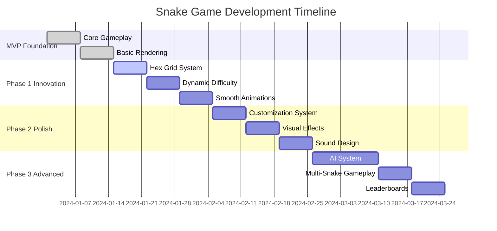

# Implementation Roadmap: Advanced Snake Game

## Executive Summary

This roadmap breaks down the snake game development into four distinct phases, each building upon the previous one. The approach prioritizes core gameplay first, then introduces innovation through hexagonal grids, followed by personalization, and finally advanced competitive features.

## Development Phases Overview



## Phase 0: Project Setup (1 week)

### Infrastructure Components
- **Project Structure**: Establish modular architecture as specified in technical spec
- **Development Environment**: Configure Python 3.8+ environment with Pygame 2.0+
- **Testing Framework**: Set up pytest with automated testing pipeline
- **Asset Pipeline**: Create directory structure for future assets

### Core Architecture Foundation
```python
# Core component initialization order
1. Configuration System
2. Event Manager
3. Input System
4. Render Engine (abstract base)
5. Game State Machine
```

### Deliverables
- [ ] Complete project structure matching technical spec
- [ ] Basic pygame window with title screen
- [ ] Configuration system with JSON loading
- [ ] Foundation tests for core components

## Phase 1: MVP Foundation (2 weeks)

### Week 1: Core Gameplay Engine

#### Day 1-2: Grid System
```python
# Priority: P0 - Critical Path
# Implementation Focus: Square grid (hex grid comes later)

class SquareGrid:
    - Coordinate validation
    - Boundary checking  
    - Neighbor calculation
    - Empty cell detection
```

#### Day 3-4: Snake Entity System
```python
# Priority: P0 - Critical Path
class Snake:
    - Segment management (head to tail)
    - Direction handling with input buffering
    - Growth mechanics
    - Self-collision detection
```

#### Day 5-7: Food System
```python
# Priority: P0 - Critical Path
class Food:
    - Random spawning on empty cells
    - Position validation
    - Consumption detection
```

### Week 2: Game Loop Integration

#### Day 8-10: Game Controller
```python
# Priority: P0 - Critical Path
class GameController:
    - Main game loop (60 FPS target)
    - State machine (menu → playing → game over)
    - Frame rate control
    - Event coordination
```

#### Day 11-12: Input System
```python
# Priority: P0 - Critical Path
class InputManager:
    - WASD key mapping
    - Input buffering for responsiveness
    - Invalid move prevention (180° turns)
    - Pause/Resume handling
```

#### Day 13-14: Basic Rendering
```python
# Priority: P0 - Critical Path
class SquareRenderer:
    - Grid cell drawing
    - Snake segment rendering
    - Food rendering
    - Basic UI (score display)
```

### Phase 1 Acceptance Criteria
- [ ] Snake moves smoothly with WASD controls
- [ ] Food spawns randomly and snake grows on consumption
- [ ] Game detects collisions (walls and self)
- [ ] Score tracking and game over flow work correctly
- [ ] 60 FPS performance maintained

### Risk Mitigation
- **Performance Risk**: Implement frame rate limiting early
- **Input Lag**: Use input buffering system from start
- **Collision Bugs**: Comprehensive unit tests for grid logic

## Phase 2: Hexagonal Innovation (3 weeks)

### Week 3: Hexagonal Grid System

#### Day 15-18: Coordinate System
```python
# Priority: P1 - Core Innovation
class HexGrid:
    - Axial coordinate system (q, r)
    - Hex-to-pixel conversion
    - Neighbor calculation (6 directions)
    - Boundary validation
```

**Technical Challenge**: Hexagonal math is complex
- **Solution**: Use NumPy for efficient coordinate calculations
- **Fallback**: Implement pure Python version if NumPy adds complexity

#### Day 19-21: Hexagonal Rendering
```python
# Priority: P1 - Core Innovation  
class HexRenderer:
    - Pointy-top hexagon drawing
    - Segment interpolation between hex centers
    - Visual grid lines for clarity
```

### Week 4: Movement and Animation

#### Day 22-25: 6-Directional Movement
```python
# Priority: P1 - Core Innovation
HEX_MAPPINGS = {
    pygame.K_w: 'NE', pygame.K_q: 'NW', 
    pygame.K_s: 'SW', pygame.K_e: 'SE',
    pygame.K_a: 'N',  pygame.K_d: 'S'
}
```

**User Experience Challenge**: 6 directions on 4-key keyboard
- **Solution**: Add modifier keys (Q/E for diagonal directions)
- **Alternative**: Consider arrow key mapping for hex movement

#### Day 26-28: Smooth Animation System
```python
# Priority: P1 - Performance Critical
class AnimationSystem:
    - Time-based interpolation
    - Separate logic tick from render frame
    - Easing functions for natural movement
```

### Week 5: Dynamic Difficulty

#### Day 29-31: Speed Scaling Algorithm
```python
# Priority: P1 - Gameplay Critical
def calculate_difficulty(score: int) -> float:
    # Exponential scaling with thresholds
    if score < 50: return 1.0
    elif score < 150: return 1.2
    elif score < 300: return 1.5
    else: return 1.0 + (score / 1000)
```

#### Day 32-33: Difficulty Events
- Visual feedback for difficulty changes
- Smooth speed transitions
- Difficulty level display

#### Day 34-35: Testing and Polish
- Performance optimization
- Bug fixes
- User experience refinement

### Phase 2 Acceptance Criteria
- [ ] Hexagonal grid displays correctly
- [ ] Snake moves naturally in 6 directions  
- [ ] Smooth 60 FPS animations maintained
- [ ] Difficulty scaling feels balanced
- [ ] Performance doesn't degrade vs square grid

### Risk Mitigation
- **Complex Math**: Thoroughly test hex coordinate system
- **Performance**: Profile animation system early
- **User Experience**: Playtest 6-directional controls extensively

## Phase 3: Personalization & Polish (3 weeks)

### Week 6: Customization Framework

#### Day 36-38: Theme System
```python
# Priority: P2 - User Experience
class ThemeManager:
    - Asset loading and caching
    - Theme switching without restart
    - Configuration management
```

#### Day 39-42: Snake Skins
- 5+ distinct visual skins
- Color pattern system
- Accessibility (color-blind friendly)

### Week 7: Visual Effects

#### Day 43-45: Food Customization
- Multiple food themes (fruits, gems, geometric)
- Particle effects for consumption
- Theme consistency

#### Day 46-49: Background System
- Layered rendering
- Multiple pattern options
- Performance optimization for complex backgrounds

### Week 8: Audio System

#### Day 50-52: Sound Effects
- Food eating sounds
- Game over feedback
- Difficulty level transitions
- Volume controls

#### Day 53-56: Integration and Testing
- Cross-platform compatibility testing
- Performance profiling
- User experience refinement

### Phase 3 Acceptance Criteria
- [ ] 5+ snake skins available and functional
- [ ] 4+ food themes with unique effects
- [ ] 6+ background patterns
- [ ] Sound effects enhance without annoying
- [ ] Customization persists between sessions

### Risk Mitigation
- **Asset Bloat**: Implement lazy loading for themes
- **Performance**: Test complex visual effects on low-end hardware
- **Accessibility**: Ensure color contrast meets standards

## Phase 4: Advanced Gameplay (4 weeks)

### Week 9-10: AI System

#### Day 57-63: AI Architecture
```python
# Priority: P3 - Advanced Feature
class AISnake(Snake):
    - A* pathfinding to food
    - Obstacle avoidance
    - Personality variations
    - Difficulty levels
```

**Technical Challenge**: Efficient pathfinding on hexagonal grid
- **Solution**: Implement hexagonal A* algorithm
- **Performance**: Use heuristic optimization for real-time play

#### Day 64-70: Behavior Trees
- Decision-making hierarchy
- Goal-oriented behavior
- Emergent gameplay patterns

### Week 11: Multi-Snake System

#### Day 71-75: Entity Management
```python
# Priority: P3 - Complex Interaction
class MultiSnakeGame:
    - Multi-entity collision detection
    - Score tracking for multiple snakes
    - Game mode variations
```

#### Day 76-77: Competitive Modes
- Survival mode (last snake alive)
- Score race mode (time-based competition)
- Free-for-all mode

### Week 12: Data & Replay

#### Day 78-81: Leaderboards
- Local high score storage
- Score validation
- Multiple game mode tracking

#### Day 82-84: Replay System
- Input recording (not video)
- Deterministic game logic
- Playback controls

### Phase 4 Acceptance Criteria
- [ ] AI snakes provide challenging gameplay
- [ ] Multi-snake collision works correctly
- [ ] Leaderboards persist across sessions
- [ ] Replay system accurately records gameplay
- [ ] Performance maintained with 4+ snakes

## Risk Assessment & Mitigation

### High-Risk Areas

1. **Hexagonal Grid Mathematics**
   - **Risk**: Complex coordinate calculations lead to bugs
   - **Mitigation**: Comprehensive unit tests, visual debugging tools
   - **Fallback**: Revert to square grid if hex proves too complex

2. **Performance with Multiple Entities**
   - **Risk**: Frame rate drops with AI snakes
   - **Mitigation**: Early profiling, spatial partitioning, object pooling
   - **Fallback**: Limit maximum snake count

3. **AI Pathfinding Complexity**
   - **Risk**: AI too slow or makes poor decisions
   - **Mitigation**: Simplified heuristics, difficulty-based complexity
   - **Fallback**: Basic random movement with food seeking

### Medium-Risk Areas

1. **Asset Management**
   - **Risk**: Large asset files impact performance
   - **Mitigation**: Lazy loading, compression, asset optimization

2. **Cross-Platform Compatibility**
   - **Risk**: Differences in pygame behavior across platforms
   - **Mitigation**: Continuous integration testing on multiple platforms

3. **User Experience with 6-Directional Controls**
   - **Risk**: Players find hex controls confusing
   - **Mitigation**: Tutorial system, control customization options

## Technology Stack Validation

### Core Dependencies
- **Python 3.8+**: ✅ Mature, cross-platform
- **Pygame 2.0+**: ✅ Active development, good 2D support
- **NumPy**: ✅ Efficient for hexagonal calculations

### Development Tools
- **pytest**: ✅ Industry standard for Python testing
- **black**: ✅ Code formatting for consistency
- **mypy**: ✅ Type checking for robustness

### Performance Considerations
- **Memory**: Snake segments as list of tuples (minimal overhead)
- **CPU**: 60 FPS target achievable on modest hardware
- **Storage**: JSON configs minimal, asset compression as needed

## Success Metrics by Phase

### Phase 1 (MVP)
- Functional snake game with core mechanics
- 60 FPS consistent performance
- < 100ms input response time

### Phase 2 (Hex Innovation)  
- Hex grid implementation with 6-directional movement
- Smooth animations with interpolation
- Balanced difficulty progression

### Phase 3 (Polish)
- 5+ customization options per category
- Audio feedback enhances experience
- User settings persist correctly

### Phase 4 (Advanced)
- AI provides challenging but fair gameplay
- Multi-snake collisions work correctly
- Replay system accurately records gameplay

## Next Steps

1. **Immediate**: Begin Phase 0 project setup
2. **Week 1**: Start MVP core gameplay implementation
3. **Continuous**: Automated testing and performance monitoring
4. **Regular**: Playtesting sessions for user experience validation

---

*Document Version: 1.0*  
*Last Updated: 2025-06-17*  
*Status: Implementation Planning Complete*