# System Architecture: Advanced Snake Game

## Overview

The snake game follows a modular, component-based architecture designed for scalability and maintainability. The system separates concerns into distinct layers while maintaining clear interfaces between components.

## High-Level Architecture

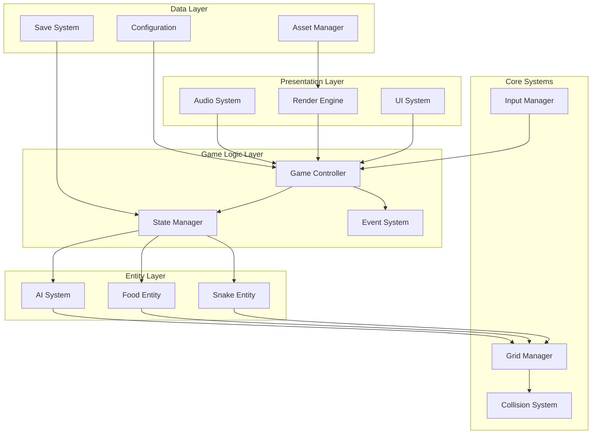
```mermaid
graph TB
    subgraph "Presentation Layer"
        UI[UI System]
        Render[Render Engine]
        Audio[Audio System]
    end
    
    subgraph "Game Logic Layer"
        Game[Game Controller]
        State[State Manager]
        Events[Event System]
    end
    
    subgraph "Entity Layer"
        Snake[Snake Entity]
        Food[Food Entity]
        AI[AI System]
    end
    
    subgraph "Core Systems"
        Grid[Grid Manager]
        Input[Input Manager]
        Physics[Collision System]
    end
    
    subgraph "Data Layer"
        Config[Configuration]
        Assets[Asset Manager]
        Save[Save System]
    end
    
    UI --> Game
    Render --> Game
    Audio --> Game
    Game --> State
    Game --> Events
    State --> Snake
    State --> Food
    State --> AI
    Snake --> Grid
    Food --> Grid
    AI --> Grid
    Grid --> Physics
    Input --> Game
    Config --> Game
    Assets --> Render
    Save --> State
```

## Component Architecture

### Core Game Loop

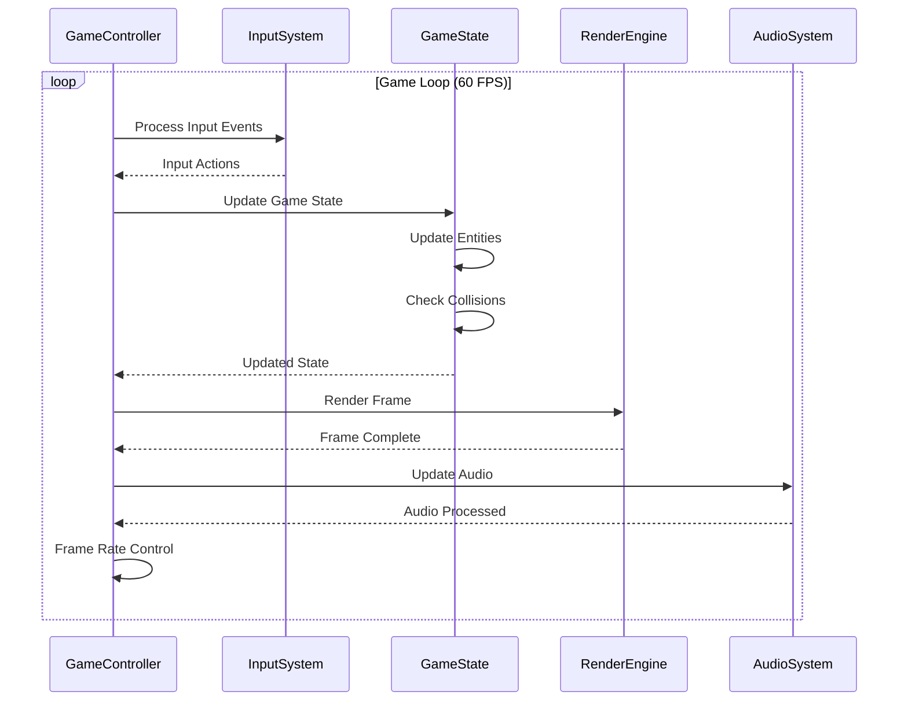
```mermaid
sequenceDiagram
    participant GC as GameController
    participant IS as InputSystem
    participant GS as GameState
    participant RE as RenderEngine
    participant AU as AudioSystem
    
    loop Game Loop (60 FPS)
        GC->>IS: Process Input Events
        IS-->>GC: Input Actions
        
        GC->>GS: Update Game State
        GS->>GS: Update Entities
        GS->>GS: Check Collisions
        GS-->>GC: Updated State
        
        GC->>RE: Render Frame
        RE-->>GC: Frame Complete
        
        GC->>AU: Update Audio
        AU-->>GC: Audio Processed
        
        GC->>GC: Frame Rate Control
    end
```

## Data Flow Architecture

### Entity Management

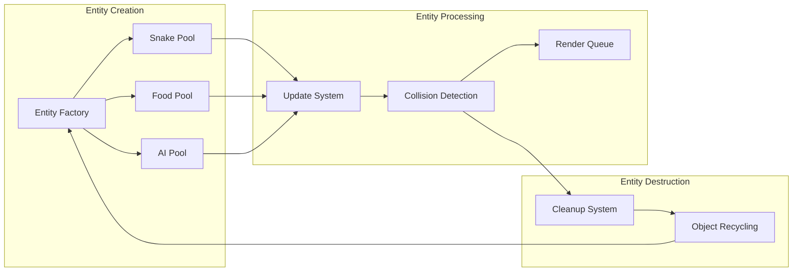
```mermaid
graph LR
    subgraph "Entity Creation"
        Factory[Entity Factory]
        SnakePool[Snake Pool]
        FoodPool[Food Pool]
        AIPool[AI Pool]
    end
    
    subgraph "Entity Processing"
        Update[Update System]
        Collision[Collision Detection]
        Render[Render Queue]
    end
    
    subgraph "Entity Destruction"
        Cleanup[Cleanup System]
        Recycling[Object Recycling]
    end
    
    Factory --> SnakePool
    Factory --> FoodPool
    Factory --> AIPool
    
    SnakePool --> Update
    FoodPool --> Update
    AIPool --> Update
    
    Update --> Collision
    Collision --> Render
    Collision --> Cleanup
    
    Cleanup --> Recycling
    Recycling --> Factory
```

## Grid System Architecture

### Grid Abstraction Layer

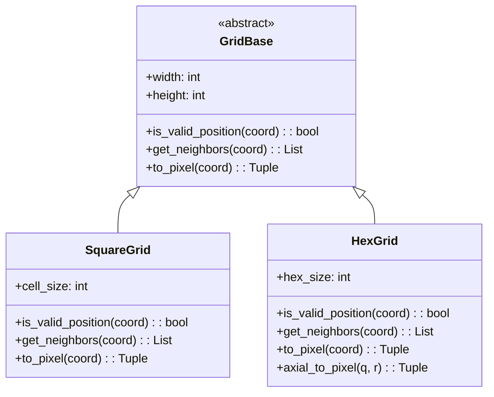
```mermaid
classDiagram
    class GridBase {
        <<abstract>>
        +width: int
        +height: int
        +is_valid_position(coord): bool
        +get_neighbors(coord): List
        +to_pixel(coord): Tuple
    }
    
    class SquareGrid {
        +cell_size: int
        +is_valid_position(coord): bool
        +get_neighbors(coord): List
        +to_pixel(coord): Tuple
    }
    
    class HexGrid {
        +hex_size: int
        +is_valid_position(coord): bool
        +get_neighbors(coord): List
        +to_pixel(coord): Tuple
        +axial_to_pixel(q, r): Tuple
    }
    
    GridBase <|-- SquareGrid
    GridBase <|-- HexGrid
```

### Coordinate System Conversion

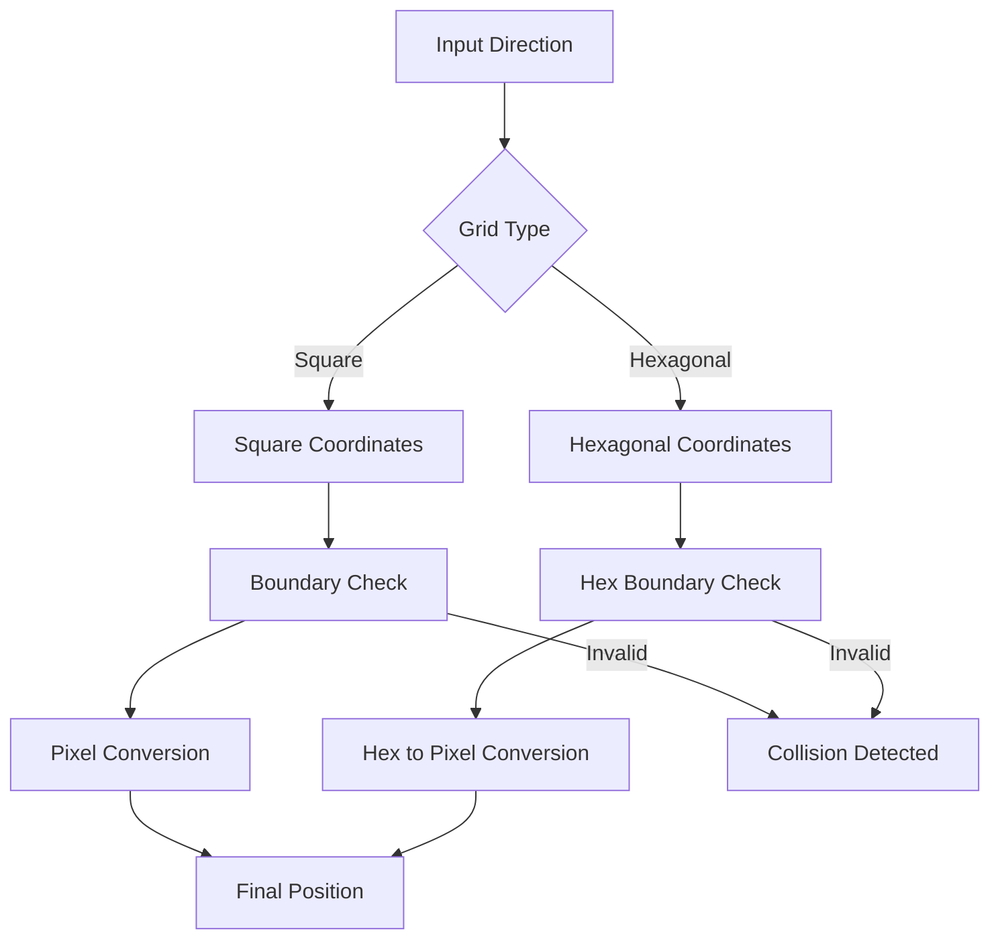
```mermaid
flowchart TD
    Start[Input Direction] --> GridType{Grid Type}
    
    GridType -->|Square| SquareCoords[Square Coordinates]
    GridType -->|Hexagonal| HexCoords[Hexagonal Coordinates]
    
    SquareCoords --> SquareValidation[Boundary Check]
    HexCoords --> HexValidation[Hex Boundary Check]
    
    SquareValidation --> SquarePixel[Pixel Conversion]
    HexValidation --> HexPixel[Hex to Pixel Conversion]
    
    SquarePixel --> Position[Final Position]
    HexPixel --> Position
    
    SquareValidation -->|Invalid| Collision[Collision Detected]
    HexValidation -->|Invalid| Collision
```

## Rendering Architecture

### Rendering Pipeline

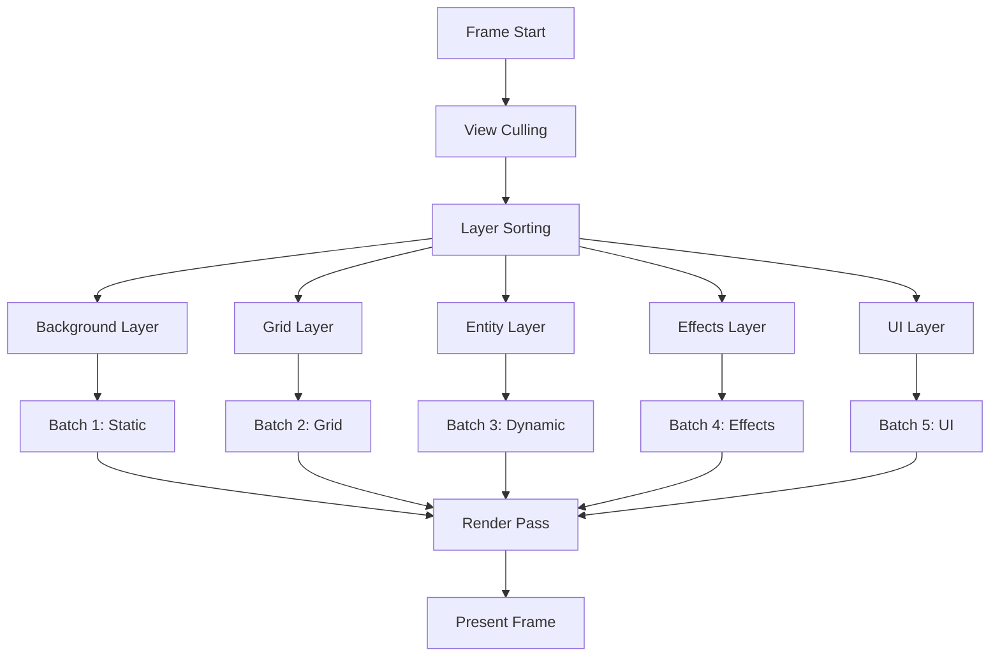
```mermaid
graph TD
    Start[Frame Start] --> Cull[View Culling]
    Cull --> Layer[Layer Sorting]
    
    Layer --> Background[Background Layer]
    Layer --> Grid[Grid Layer]
    Layer --> Entities[Entity Layer]
    Layer --> Effects[Effects Layer]
    Layer --> UI[UI Layer]
    
    Background --> Batch1[Batch 1: Static]
    Grid --> Batch2[Batch 2: Grid]
    Entities --> Batch3[Batch 3: Dynamic]
    Effects --> Batch4[Batch 4: Effects]
    UI --> Batch5[Batch 5: UI]
    
    Batch1 --> Render[Render Pass]
    Batch2 --> Render
    Batch3 --> Render
    Batch4 --> Render
    Batch5 --> Render
    
    Render --> Present[Present Frame]
```

### Animation System

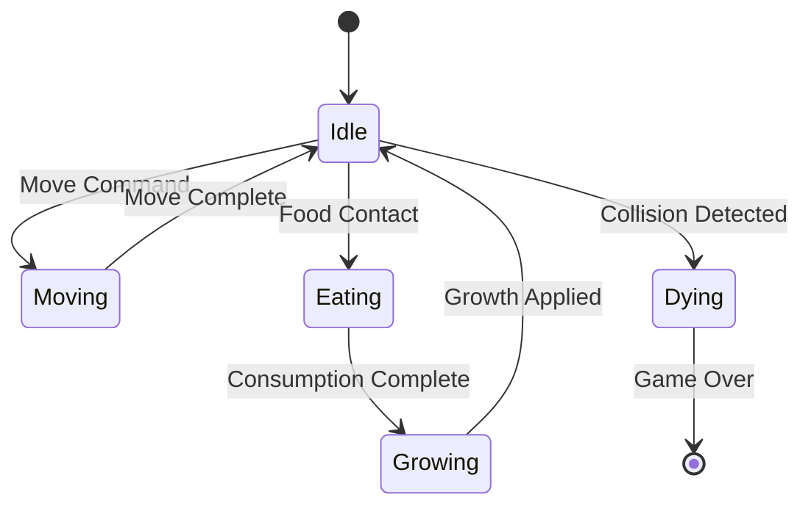
```mermaid
stateDiagram-v2
    [*] --> Idle
    Idle --> Moving: Move Command
    Moving --> Idle: Move Complete
    Idle --> Eating: Food Contact
    Eating --> Growing: Consumption Complete
    Growing --> Idle: Growth Applied
    Idle --> Dying: Collision Detected
    Dying --> [*]: Game Over
```

## Input System Architecture

### Input Processing Pipeline

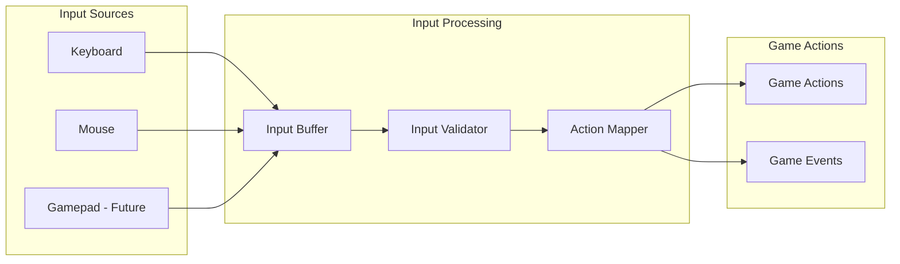
```mermaid
graph LR
    subgraph "Input Sources"
        Keyboard[Keyboard]
        Mouse[Mouse]
        Gamepad[Gamepad - Future]
    end
    
    subgraph "Input Processing"
        Buffer[Input Buffer]
        Validator[Input Validator]
        Mapper[Action Mapper]
    end
    
    subgraph "Game Actions"
        Actions[Game Actions]
        Events[Game Events]
    end
    
    Keyboard --> Buffer
    Mouse --> Buffer
    Gamepad --> Buffer
    
    Buffer --> Validator
    Validator --> Mapper
    Mapper --> Actions
    Mapper --> Events
```

### Input Buffer System

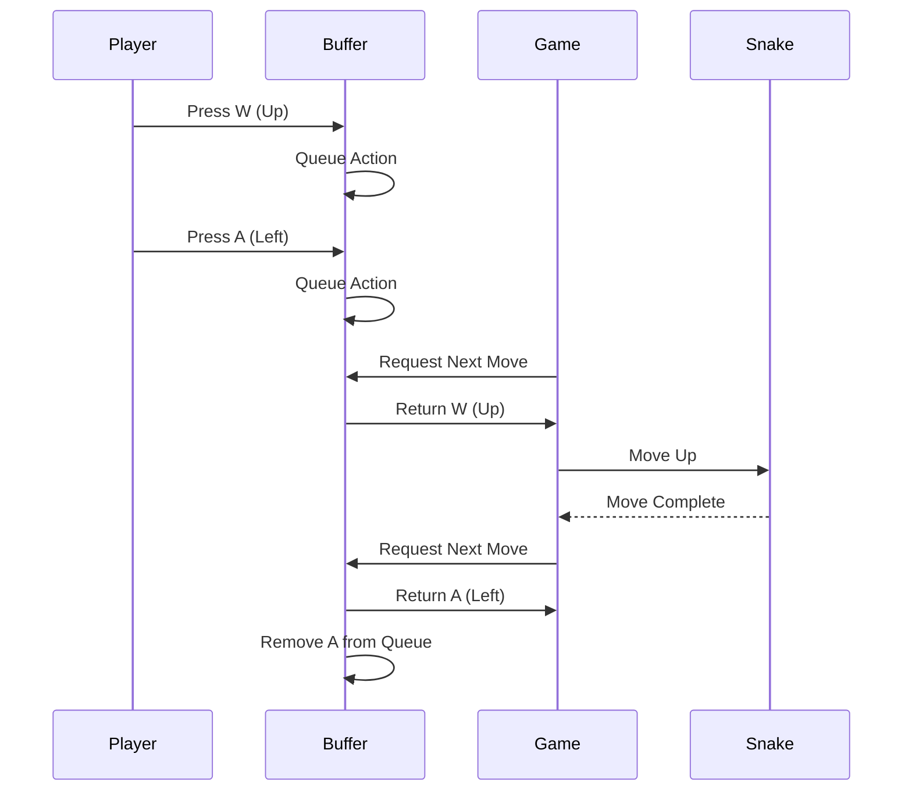
```mermaid
sequenceDiagram
    participant Player
    participant Buffer
    participant Game
    participant Snake
    
    Player->>Buffer: Press W (Up)
    Buffer->>Buffer: Queue Action
    
    Player->>Buffer: Press A (Left)
    Buffer->>Buffer: Queue Action
    
    Game->>Buffer: Request Next Move
    Buffer->>Game: Return W (Up)
    
    Game->>Snake: Move Up
    Snake-->>Game: Move Complete
    
    Game->>Buffer: Request Next Move
    Buffer->>Game: Return A (Left)
    Buffer->>Buffer: Remove A from Queue
```

## State Management Architecture

### Game State Machine

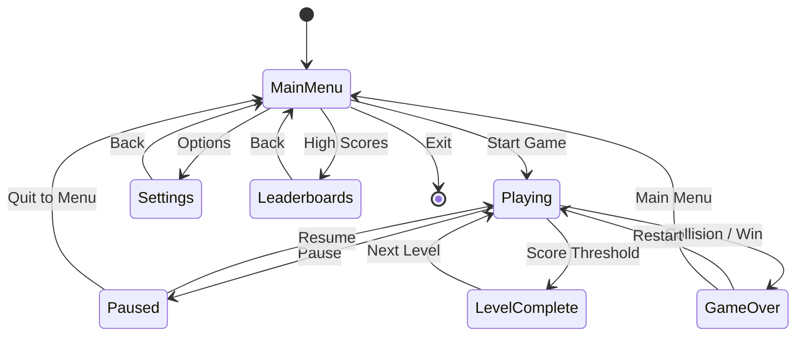
```mermaid
stateDiagram-v2
    [*] --> MainMenu
    MainMenu --> Playing: Start Game
    MainMenu --> Settings: Options
    MainMenu --> Leaderboards: High Scores
    MainMenu --> [*]: Exit
    
    Settings --> MainMenu: Back
    Leaderboards --> MainMenu: Back
    
    Playing --> Paused: Pause
    Paused --> Playing: Resume
    Paused --> MainMenu: Quit to Menu
    
    Playing --> GameOver: Collision / Win
    GameOver --> Playing: Restart
    GameOver --> MainMenu: Main Menu
    
    Playing --> LevelComplete: Score Threshold
    LevelComplete --> Playing: Next Level
```

### State Data Flow

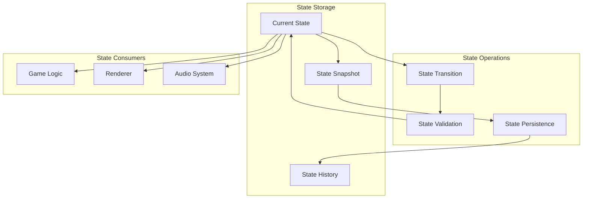
```mermaid
graph TB
    subgraph "State Storage"
        CurrentState[Current State]
        StateHistory[State History]
        StateSnapshot[State Snapshot]
    end
    
    subgraph "State Operations"
        Transition[State Transition]
        Validation[State Validation]
        Persistence[State Persistence]
    end
    
    subgraph "State Consumers"
        GameLogic[Game Logic]
        Renderer[Renderer]
        AudioSystem[Audio System]
    end
    
    CurrentState --> Transition
    Transition --> Validation
    Validation --> CurrentState
    
    CurrentState --> StateSnapshot
    StateSnapshot --> Persistence
    Persistence --> StateHistory
    
    CurrentState --> GameLogic
    CurrentState --> Renderer
    CurrentState --> AudioSystem
```

## AI System Architecture

### AI Decision Making

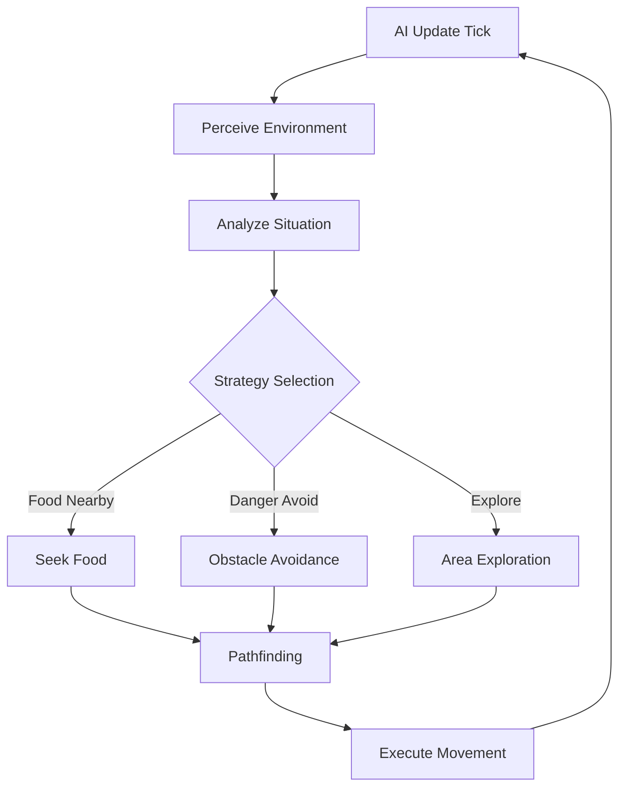
```mermaid
graph TD
    Start[AI Update Tick] --> Perceive[Perceive Environment]
    Perceive --> Analyze[Analyze Situation]
    
    Analyze --> Strategy{Strategy Selection}
    Strategy -->|Food Nearby| FoodSeek[Seek Food]
    Strategy -->|Danger Avoid| Avoid[Obstacle Avoidance]
    Strategy -->|Explore| Explore[Area Exploration]
    
    FoodSeek --> Pathfind[Pathfinding]
    Avoid --> Pathfind
    Explore --> Pathfind
    
    Pathfind --> Execute[Execute Movement]
    Execute --> Start
```

### Pathfinding Architecture

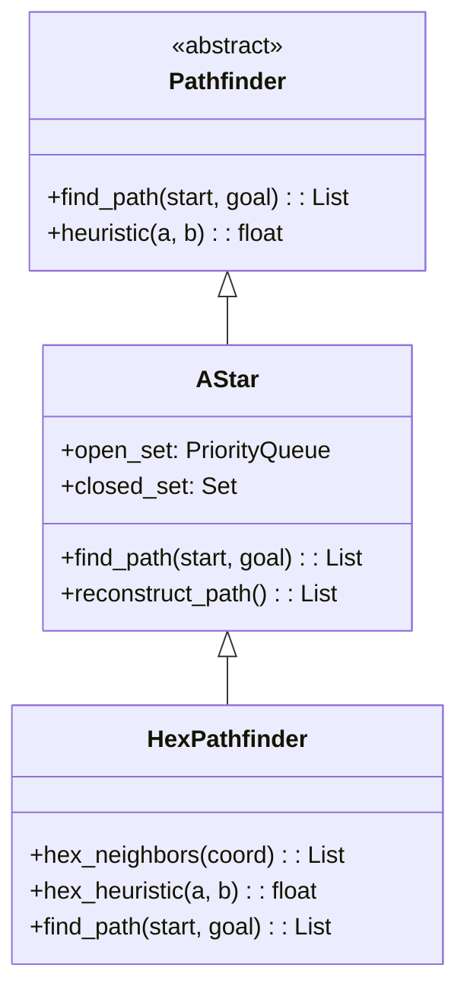
```mermaid
classDiagram
    class Pathfinder {
        <<abstract>>
        +find_path(start, goal): List
        +heuristic(a, b): float
    }
    
    class AStar {
        +open_set: PriorityQueue
        +closed_set: Set
        +find_path(start, goal): List
        +reconstruct_path(): List
    }
    
    class HexPathfinder {
        +hex_neighbors(coord): List
        +hex_heuristic(a, b): float
        +find_path(start, goal): List
    }
    
    Pathfinder <|-- AStar
    AStar <|-- HexPathfinder
```

## Performance Architecture

### Object Pooling System

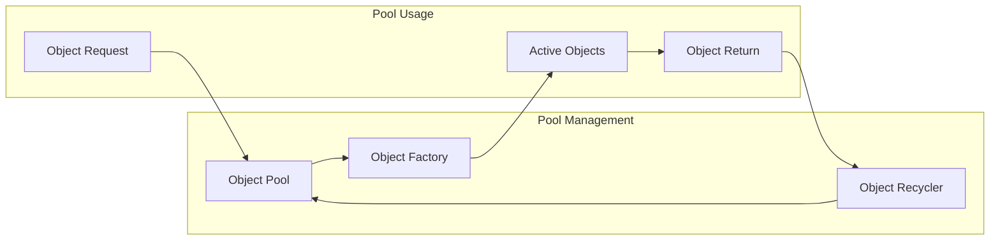
```mermaid
graph LR
    subgraph "Pool Management"
        Pool[Object Pool]
        Factory[Object Factory]
        Recycler[Object Recycler]
    end
    
    subgraph "Pool Usage"
        Request[Object Request]
        Return[Object Return]
        Active[Active Objects]
    end
    
    Request --> Pool
    Pool --> Factory
    Factory --> Active
    
    Active --> Return
    Return --> Recycler
    Recycler --> Pool
```

### Rendering Optimization

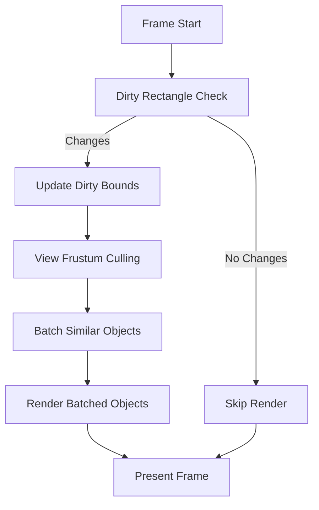
```mermaid
graph TD
    Frame[Frame Start] --> DirtyCheck[Dirty Rectangle Check]
    DirtyCheck -->|No Changes| Skip[Skip Render]
    DirtyCheck -->|Changes| UpdateBounds[Update Dirty Bounds]
    
    UpdateBounds --> Culling[View Frustum Culling]
    Culling --> Batch[Batch Similar Objects]
    Batch --> Render[Render Batched Objects]
    Render --> Present[Present Frame]
    
    Skip --> Present
```

## Data Persistence Architecture

### Save System Design

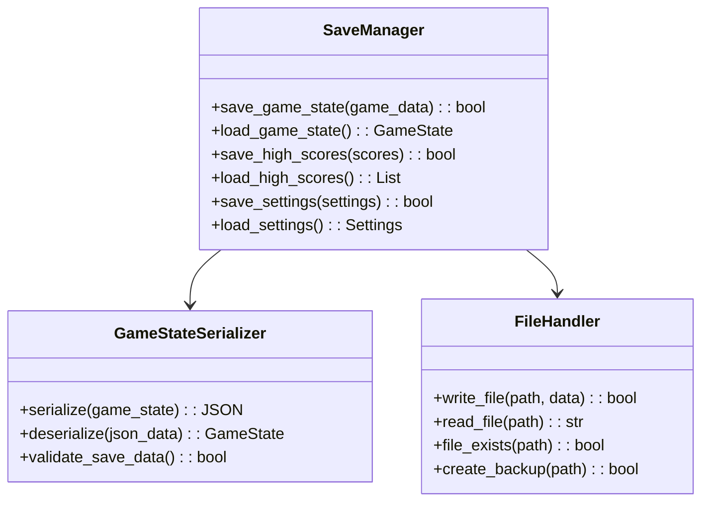
```mermaid
classDiagram
    class SaveManager {
        +save_game_state(game_data): bool
        +load_game_state(): GameState
        +save_high_scores(scores): bool
        +load_high_scores(): List
        +save_settings(settings): bool
        +load_settings(): Settings
    }
    
    class GameStateSerializer {
        +serialize(game_state): JSON
        +deserialize(json_data): GameState
        +validate_save_data(): bool
    }
    
    class FileHandler {
        +write_file(path, data): bool
        +read_file(path): str
        +file_exists(path): bool
        +create_backup(path): bool
    }
    
    SaveManager --> GameStateSerializer
    SaveManager --> FileHandler
```

## Configuration Architecture

### Settings Management

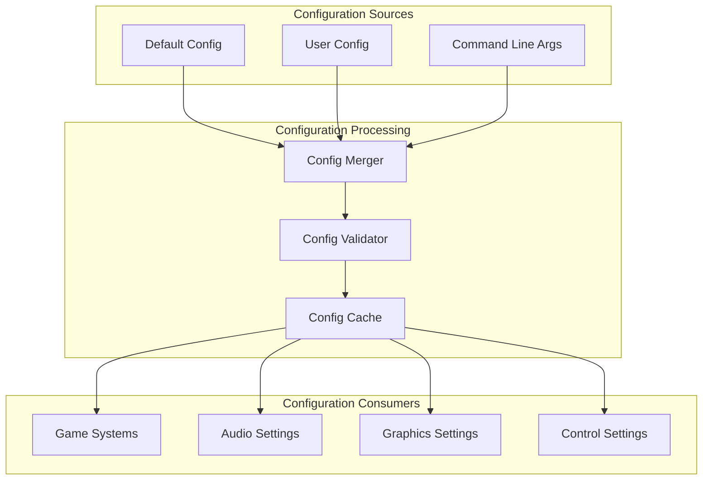
```mermaid
graph TB
    subgraph "Configuration Sources"
        Default[Default Config]
        UserConfig[User Config]
        CommandLine[Command Line Args]
    end
    
    subgraph "Configuration Processing"
        Merger[Config Merger]
        Validator[Config Validator]
        Cache[Config Cache]
    end
    
    subgraph "Configuration Consumers"
        Game[Game Systems]
        Audio[Audio Settings]
        Graphics[Graphics Settings]
        Controls[Control Settings]
    end
    
    Default --> Merger
    UserConfig --> Merger
    CommandLine --> Merger
    
    Merger --> Validator
    Validator --> Cache
    
    Cache --> Game
    Cache --> Audio
    Cache --> Graphics
    Cache --> Controls
```

## Error Handling Architecture

### Exception Hierarchy

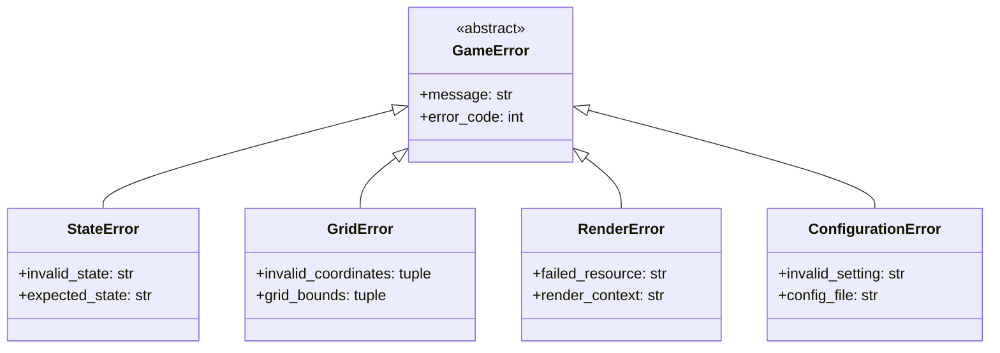
```mermaid
classDiagram
    class GameError {
        <<abstract>>
        +message: str
        +error_code: int
    }
    
    class StateError {
        +invalid_state: str
        +expected_state: str
    }
    
    class GridError {
        +invalid_coordinates: tuple
        +grid_bounds: tuple
    }
    
    class RenderError {
        +failed_resource: str
        +render_context: str
    }
    
    class ConfigurationError {
        +invalid_setting: str
        +config_file: str
    }
    
    GameError <|-- StateError
    GameError <|-- GridError
    GameError <|-- RenderError
    GameError <|-- ConfigurationError
```

### Error Recovery Strategies

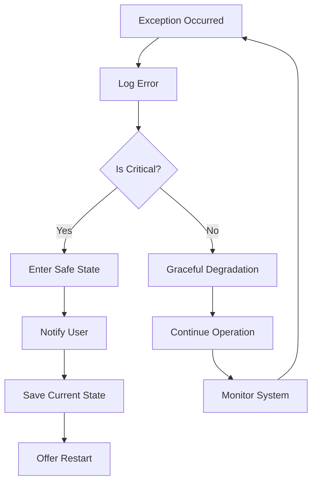
```mermaid
graph TD
    Error[Exception Occurred] --> Log[Log Error]
    Log --> Critical{Is Critical?}
    
    Critical -->|Yes| SafeState[Enter Safe State]
    Critical -->|No| Graceful[Graceful Degradation]
    
    SafeState --> Notify[Notify User]
    Graceful --> Continue[Continue Operation]
    
    Notify --> Save[Save Current State]
    Save --> Restart[Offer Restart]
    
    Continue --> Monitor[Monitor System]
    Monitor --> Error
```

## Security Architecture

### Input Validation

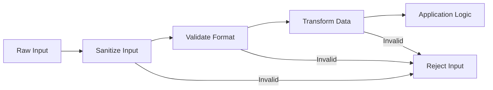
```mermaid
graph LR
    Input[Raw Input] --> Sanitize[Sanitize Input]
    Sanitize --> Validate[Validate Format]
    Validate --> Transform[Transform Data]
    Transform --> Application[Application Logic]
    
    Sanitize -->|Invalid| Reject[Reject Input]
    Validate -->|Invalid| Reject
    Transform -->|Invalid| Reject
```

### Resource Protection

```mermaid
graph TB
    Resource[Game Resource] --> Access[Access Request]
    Access --> Authenticate[Authenticate Request]
    Authenticate --> Authorize[Check Permissions]
    Authorize --> Audit[Log Access]
    Audit --> Grant[Grant Access]
    
    Authenticate -->|Fail| Deny[Deny Access]
    Authorize -->|Fail| Deny
```

## Testing Architecture

### Test Pyramid

```mermaid
graph TB
    subgraph "Unit Tests (70%)"
        GridTests[Grid System Tests]
        EntityTests[Entity Tests]
        UtilTests[Utility Tests]
    end
    
    subgraph "Integration Tests (20%)"
        SystemTests[System Integration Tests]
        APITests[API Tests]
        StateTests[State Machine Tests]
    end
    
    subgraph "End-to-End Tests (10%)"
        GameplayTests[Gameplay Tests]
        UITests[UI Tests]
        PerformanceTests[Performance Tests]
    end
    
    GridTests --> SystemTests
    EntityTests --> SystemTests
    SystemTests --> GameplayTests
    UITests --> GameplayTests
```

## Deployment Architecture

### Build System

```mermaid
graph LR
    Source[Source Code] --> Lint[Linting]
    Lint --> Test[Unit Tests]
    Test --> Build[Build Application]
    Build --> Package[Package Distribution]
    Package --> Deploy[Deploy to Target]
    
    Test -->|Fail| Fix[Fix Issues]
    Fix --> Lint
    
    Build -->|Fail| Debug[Debug Build]
    Debug --> Test
```

---

*Document Version: 1.0*  
*Last Updated: 2025-06-17*  
*Status: Architecture Design Complete*